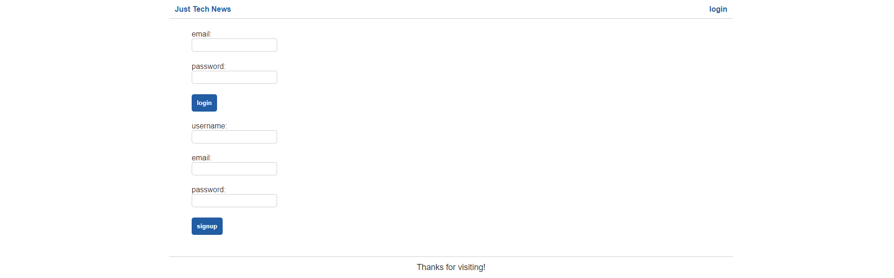
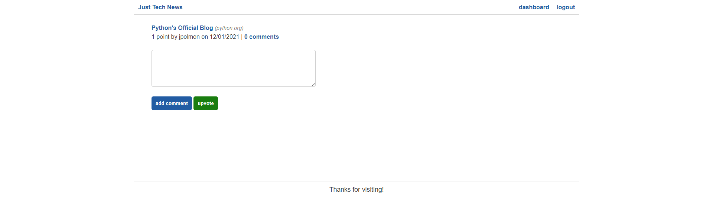

# Python : Badge Generator

## Purpose

The purpose of this project was to use Python along with Flask to create the back end for the existing front end for a website that allows users to post, upvote, and comment on news article links. This involved setting up a MySQL database, handling account creation, taking in user inputs and storing them in the database, routing all of the pages, and hooking up the database to the front end to properly display the stored information.  

Some features of the app are:

- When the user visits the site for the first time they are able to view all of the posted articles. 
- When the user visits the login page they are prompted to either use their existing login or sign up. 
- When the user signs in they are able to interact with posts by commenting and/or upvoting.
- While signed in the user can go to their dashboard and either post new links or edit/delete existing links they have posted.  

This application can be found at: http://python-just-tech.herokuapp.com/

---

## Appearance
 

### Here is what a user sees when they first visit the site:
 

 

### Here is what a user sees when they go to login or sign up:
 

 

### Here is what a user that is not logged in sees when they visit a post:
 

### Here is what a user that is logged in sees when they visit a post:
 

### Here is what a user sees when they visit their dashboard:
 

